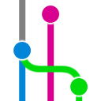

# Ведение проектов в системе контроля версий git


Все проекты по разработке ПО, вне зависимости от платформы, фреймворка и железа, необходимо вести с учетом котроля версий. Стандартом индустрии для контроля версий в разработке ПО является SCM (система котроля версий) git, её мы и используем. Данный гайд подразумевает базовые знание git.

## Prerequisites - необходимые иструменты

*  [Собственно сама программа git](https://git-scm.com/downloads) с клиентом для коммандной строки (CLI) - обязательно.
*  [Visual Studio Code](https://code.visualstudio.com/Download) - Есть интеграция git с улучшенным diff и управлением через GUI - опционально.
*  [Git Graph](https://marketplace.visualstudio.com/items?itemName=mhutchie.git-graph) - Плагин для VSCode c визуализацией  - опционально.

*  [Sourcetree](https://www.sourcetreeapp.com/) - GUI git клиент для Windows и Mac, в основном повторяет функционал VSCode с плагинами - опционально.

***

## Git flow


Для начального ознакомления с принципами рабочего процесса предлагаю пройтись по [статье](https://www.atlassian.com/ru/git/tutorials/comparing-workflows/gitflow-workflow).
Не смотря на то, что в начале статьи сказано о том, что процесс устарел и не актуален, в контрактной разработке embedded проектов и при создании сопутствующих им прототипов, что не требует их постоянной поддержки и разработки, нам этот процесс подходит лучше всего.

***

## Последовательность действий


### Ведение проекта в git начинается с инициализации репозитория и первого (пустого) коммита в нем.

Создаем репозиторий. Делаем в нем первый пустой коммит `--allow-empty` на ветке main с commit-message `-m` "Initial commit" и ставим свою подпись `-s` .

```
git init
git commit --allow-empty -m "Initial commit" -s
```

### Создаем ветку develop

Далее необходимо создать ветку develop и синхронизировать её с remote репозиторием.
Ветка разработки develop предназначена для объединения всех функций (фич). В ветку main попадают изменения, которые являются фундаментальными и полностью прошедшими основные этапы разработки, слияние в master можно считать релизом и необходимо сопровождать тегом с номером версии.

```
git branch develop
git push -u origin develop
```

### Создаем .gitignore

Репозиторий **должен** содержать файл `.gitignore` в корневой папке.

.gitignore должен включать в себя файлы локальных настроек, артефактов сборки и прочие "мусорные" файлы и папки, которые не несут пользы для тех, кто ведет параллельную разработку или просто изучает исходный код проекта.

Папки и файлы, добавленные в `.gitignore` будут отличаться в разных средах разработки.

#### Полезные ссылки:
* [Официальный мануал по .gitignore](https://git-scm.com/docs/gitignore)
* [Про использование .gitignore](https://www.atlassian.com/git/tutorials/saving-changes/gitignore)
* [Коллекция шаблонов .gitignore для разных языков и фреймворков](https://github.com/github/gitignore)
* [Пример .gitignore для STM32CubeIDE](https://www.reddit.com/r/embedded/comments/scezb8/comment/hu88swv/?utm_source=reddit&utm_medium=web2x&context=3)
* [Пример .gitignore для nRF Connect SDK](https://github.com/nrfconnect/sdk-nrf/blob/main/.gitignore)
* [Пример .gitignore для Flutter](https://github.com/flutter/flutter/blob/master/.gitignore)

### Создаем Readme.md

*Желательно* создать файл Readme.md в корне репозитория. Сначала он может содержать лишь заголовок с названием проекта.

```
# Project name

```
** Пустая строка внизу не случайна! :)

В дальнейшем он может наполняться ссылками на документацию по проекту или использованым библиотекам, инструкции и прочее, аналогичные файлы могут находиться в разных папках соответствующих модулей проекта для более структуризированной и точечной информации.

#### Полезные ссылки:
* [About READMEs](https://docs.github.com/en/repositories/managing-your-repositorys-settings-and-features/customizing-your-repository/about-readmes)

### Создаем проект 

Стартовой точкой *разработки* будет служить создание пустого проекта.
В зависимости от платформы, фреймворка и прочих условий, проект может иметь разную структуру и разрабатываться в разных средах разработки (IDE).

Делаем коммит на ветке develop.

### Под каждый таск с новым функционалом делаем ветку feature/[branch_name]

Каждый таск, выполнение которого подразумевает разработку нового функционала, требует создание новой ветки основываясь на `develop`. Название ветки должно соответсвовать схеме `feature/[task_name]`.

Под каждый sub-task создавать ветку не обязательно.

### Pull-request (PR) и ревью

После выполнения задачи или какой-то из подзадач в комплексном таске - делаем ревью.
Ревью должен проводить лид или кто-то еще из команды, в зависимости от задачи. После ревью даются комментарии и после исправлений выполняется merge ветки в develop. Merge выполняет проверяющий, на которого назначен PR.

## Тестирование

Если функционал нужно тестировать с какими-то изменениями в общий проект, не совместимыми с общей задачей проекта (не таска). Создаем рядом копию проекта и там тестируем. Файлы нового функционала должны быть только в одном месте и в проектах должны быть ссылки именно туда. После тестов в тестовом проекте, нужно проверить функционал и в основном, если это возможно.

При необходимости можно создавать ветки с названиями по схеме `testing/[task_name]`, такие ветки используются для котроля версий и отслеживания изменений, но не вливаются в общий проект и не должны проходить ревью.

## Submodules

Библиотеки, драйверы с открытым исходным кодом или разработанные ранее нашей командой, которые существуют внутри git репозиториев, могут подключаться к текущему проекту в виде субмодулей (submodules).

```
git submodule add https://github.com/chaconinc/DbConnector external/
```
Субмодули должны помещаться в папке `external`.


## Ссылки на источники:

* [Cheat Sheet - Шпаргалка](https://git-scm.com/docs)

* [Pro Git book](https://git-scm.com/book/uk/v2)

* [Git Reference manual](https://git-scm.com/docs)

* [Pro Git book - 7.11 Інструменти Git - Підмодулі](https://git-scm.com/book/uk/v2/%D0%86%D0%BD%D1%81%D1%82%D1%80%D1%83%D0%BC%D0%B5%D0%BD%D1%82%D0%B8-Git-%D0%9F%D1%96%D0%B4%D0%BC%D0%BE%D0%B4%D1%83%D0%BB%D1%96)

* [Рабочий процесс Gitflow Workflow](https://www.atlassian.com/ru/git/tutorials/comparing-workflows/gitflow-workflow#:~:text=Git%2Dflow%20%E2%80%94%20%D0%B0%D0%BB%D1%8C%D1%82%D0%B5%D1%80%D0%BD%D0%B0%D1%82%D0%B8%D0%B2%D0%BD%D0%B0%D1%8F%20%D0%BC%D0%BE%D0%B4%D0%B5%D0%BB%D1%8C%20%D0%B2%D0%B5%D1%82%D0%B2%D0%BB%D0%B5%D0%BD%D0%B8%D1%8F,%D0%92%D0%B8%D0%BD%D1%81%D0%B5%D0%BD%D1%82%D0%BE%D0%BC%20%D0%94%D1%80%D0%B8%D1%81%D1%81%D0%B5%D0%BD%D0%BE%D0%BC%20%D0%BD%D0%B0%20%D1%81%D0%B0%D0%B9%D1%82%D0%B5%20nvie.)

